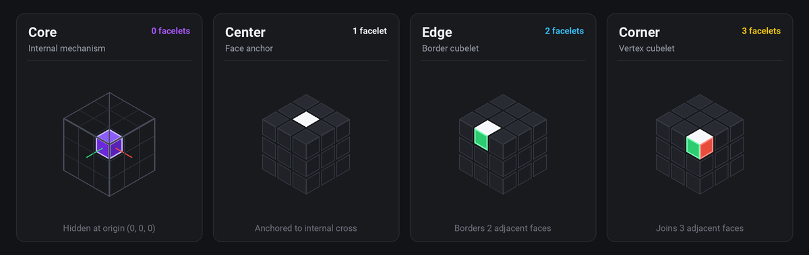
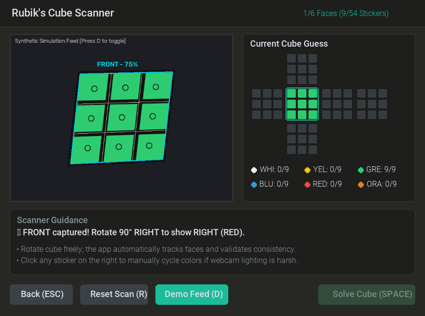

# Rubix

> A **Functional Pearl**: A minimalistic Rubik's Cube solver in **under 400 lines of Python**, powered by **linear algebra**, accompanied by an interactive visualizer.


Most Rubik's cube software relies on complex combinatorial representations: 54 color stickers mapped across 6 face arrays, lookup tables for permutations, or massive pattern databases.

**Rubix takes a different path.** By framing the puzzle in discrete 3-dimensional Euclidean space, the entire physics and state of the Rubik's Cube reduces to **vectors, rotation matrices, and dot products**. The core solver ([`rubix.py`](rubix.py)) reliably solves full 100,000-move scrambles in **seconds** with zero external puzzle libraries, pattern databases, or precomputed tables (typically ~10–25s).

---

## The Math Behind the Magic

### 1. Discrete 3D Coordinate Space

Anchor a 3D Cartesian coordinate frame at the center of the cube $(0, 0, 0)$. Each of the 27 smaller *cubelets* has integer coordinates $(x, y, z) \in \lbrace -1, 0, 1 \rbrace^3$.

```
           +Z (Top / White)
            ^
            |   +Y (Right / Red)
            |  /
            | /
  (-X) <----+----> +X (Front / Green)
 (Blue)    /|
          / |
         v  v
 (-Orange)  (-Yellow)
```

The $L_1$ norm (Manhattan distance from origin) naturally and bijectively classifies every cubelet:

$$\|c\|_1 = |x| + |y| + |z|$$

| $\|c\|_1$ | Cubelet Type | Count | Description |
|:---:|:---|:---:|:---|
| **0** | Interior | 1 | The hidden center mechanism; never moves. |
| **1** | Center | 6 | Fixed centers; rotate in place, define face colors. |
| **2** | Edge | 12 | 2 visible colored faces. |
| **3** | Corner | 8 | 3 visible colored faces. |

Total: $1 + 6 + 12 + 8 = 27$ cubelets.



### 2. State: Vectors and Rotation Matrices

A cube state is a mapping from each of the 26 non-interior cubelets to its current rotation matrix:

$$\text{Cube} = \left\lbrace (c, R) \mid c \in \lbrace -1, 0, 1 \rbrace^3 \setminus \lbrace (0,0,0) \rbrace \right\rbrace$$

- $c \in \lbrace -1, 0, 1 \rbrace^3$ is the **constant canonical home position** of the cubelet (its coordinate in the solved cube).
- $R$ is a $3 \times 3$ **rotation matrix** tracking how the cubelet has been turned from its home orientation.

**How rotation matrices work here:**
1. **Initial state:** Every cubelet starts with the $3 \times 3$ identity matrix $I_3$ (meaning "not rotated yet").
2. **Current position:** The matrix-vector product gives the cubelet's current $(x, y, z)$ position in space:
   $$p = R \cdot c$$
   In the solved cube, $p = I_3 \cdot c = c$.
3. **Face orientation:** The columns of $R$ directly indicate where the cubelet's original Front, Right, and Top faces are pointing in space right now.
4. **Applying moves:** When a 90° slice rotation matrix $M$ affects a cubelet, its new orientation is simply:
   $$R_{\text{new}} = M \cdot R$$
   Because every turn is a 90° rotation along an axis, all entries in $R$ remain simple integers in $\lbrace -1, 0, 1 \rbrace$.

### 3. Face Colors and Solved Invariant

Each of the 6 face colors is associated with a standard unit normal vector:

| Direction Vector | Color | Face |
|:---|:---|:---|
| $(+1, 0, 0)$ | Green | Front |
| $(-1, 0, 0)$ | Blue | Back |
| $(0, +1, 0)$ | Red | Right |
| $(0, -1, 0)$ | Orange | Left |
| $(0, 0, +1)$ | White | Top |
| $(0, 0, -1)$ | Yellow | Bottom |

For any cubelet $c$, its colors in the solved cube point in directions given by the columns of the diagonal matrix $\mathrm{diag}(c)$. When the cubelet undergoes orientation $R$, its colored faces now point in directions:

$$\text{Color directions} = R \cdot \mathrm{diag}(c)$$

A cubelet is in its solved position and orientation if and only if:

$$R \cdot \mathrm{diag}(c) = \mathrm{diag}(c)$$

### 4. Slice Moves as Hyperplane Rotations

A move is specified by a unit normal vector $v \in \lbrace \pm e_x, \pm e_y, \pm e_z \rbrace$ and a direction $d \in \lbrace -1, +1 \rbrace$ (clockwise or counterclockwise 90° rotation).

Which cubelets belong to the rotating slice? In linear algebra, this is a half-space test:

$$v \cdot p > 0 \iff v \cdot (R \cdot c) > 0$$

If this dot product is positive, the cubelet lies in the slice and is rotated by the elementary 90° rotation matrix $M$:

$$R_{\text{new}} = M \cdot R$$

No permutations to maintain, no index tables to keep in sync. Moving a slice is a matrix multiplication filtered by an inner product.

---

## Solver Architecture

Finding the optimal solution to an arbitrary Rubik's cube is NP-hard, and God's Number (20 moves) requires massive precomputed pattern databases.

[`rubix.py`](rubix.py) implements a **hierarchical multi-phase A\* search** that mimics human layer-by-layer reduction, staying strictly under 400 lines without precomputed databases:

```
[Scrambled Cube]
       |
       v
Phase 1: Top Layer & Centers (17 cubelets)
       |
       v
Phase 2: Middle Layer Edges (4 cubelets)
       |
       v
Phase 3: Bottom Cross (4 edge orientations & positions)
       |
       v
Phase 4: Bottom Corners (4 corner placements & twists)
       |
       v
Phase 5: Endgame Permutation Alignment
       |
       v
 [Solved Cube]
```

### Guiding the Search: Distance Estimation
A\* needs a sense of direction so it doesn't search aimlessly. Rather than storing gigabytes of precomputed lookup tables, Rubix calculates a quick distance estimate on the fly:
- **Individual piece distance (`min_moves_to_solved`):** Calculates how many 90° turns an isolated cubelet needs to reach its solved coordinate and orientation if no other pieces were in the way.
- **Layer distance:** Combines the individual estimates of the active layer's target pieces into a single distance score, pulling the search toward states where more pieces are closer to home.
- **State caching:** Evaluates successor states with memoized transposition caching (`@functools.cache`).

### Search Performance & Randomized Restarts
- **Throughput:** Simulates ~50,000 moves/sec via vector dot products and memoized transposition caching.
- **Randomized Restarts:** To escape deep local plateaus in complex scrambles without storing massive precomputed pattern tables, A\* incorporates subtle priority randomization (`RANDOMIZE_SEARCH = True`) protected by exponential restart timeouts (`with_restarts`). Typical scrambles solve in 5–20 seconds; difficult configurations that trigger a restart typically resolve in under a minute.

---

## Getting Started

### Prerequisites
- Python 3.10+
- Virtual environment (`venv`)

### Installation

```bash
# Clone the repository
git clone https://github.com/smolkaj/rubix.git
cd rubix

# Create and activate a virtual environment
python3 -m venv rubix_env
source rubix_env/bin/activate

# Install dependencies (numpy, pygame, opencv-python)
pip install -r requirements.txt
```

---

## Usage

### 1. Interactive Pygame Visualizer

Launch the 2D cube net visualizer:

```bash
python rubix_gui.py
```

- **Scan my cube:** Launch the real-time webcam scanner (or press `S`) to scan a physical cube by naturally rotating it in front of the camera.
- **Shuffle:** Click the **Shuffle** button to apply a 999-move scramble.
- **Solve:** Click the **Solve** button to run the A\* solver with a real-time progress bar.
- **Playback:**
  - `Right Arrow`: Step forward through the solution moves (hold to fast-forward at 15×).
  - `Left Arrow`: Step backward through the solution moves (rewind).

### 2. Real-Time Webcam Scanner

Scan a physical Rubik's cube without rigid grid constraints (similar to Apple card scanning):

```bash
# Launch scanner directly
python rubix_scanner.py
```



- **Continuous AR Detection:** Hold and rotate the cube naturally in front of your camera. Real-time contour and perspective tracking locks onto the cube face and overlays an augmented reality (AR) 3x3 grid.
- **Live Hypothesis Model:** An unfolded 2D net view shows the app's evolving guess of all 54 facelets with color counters.
- **Dynamic Rotation Guidance:** Provides clear, real-time feedback on how to rotate the cube next (*"👉 Front captured! Rotate 90° RIGHT to show RED"*).
- **Physical Invariant Verification:** Detects color imbalances, impossible edges, or corner chirality errors live, guiding the user to re-show conflicting faces.
- **Interactive Correction:** Click any sticker on the live guess net to cycle colors if harsh ambient lighting causes a misread.
- **Synthetic Demo Feed:** Press `D` to toggle a simulated 3D rotating cube feed for testing on headless machines or without a webcam.
- **Instant Solve:** Press `SPACE` or click **Solve Cube** once verified to import the scanned cube directly into the step-by-step solver.

### 3. Command-Line Solver

Solve a scrambled cube directly from the terminal:

```bash
# Solve a 100,000-move scramble with default seed (42)
python rubix.py

# Solve with a specific random seed
python rubix.py 123

# Run benchmark across 100 random scrambles
python rubix.py --benchmark
```

### 3. Programmatic Python API

Use `rubix` as a lightweight puzzle simulation and solving library:

```python
from rubix import solved_cube, shuffle, solve, describe_move, is_cube_solved, apply_move_to_cube

# Create a scrambled cube
scrambled = shuffle(solved_cube, iterations=1000, seed=42)
print("Is solved?", is_cube_solved(scrambled))  # False

# Compute solution moves
solution = solve(scrambled)
print(f"Solved in {len(solution)} moves:")
for move in solution:
    print(" -", describe_move(move))

# Apply solution and verify final state
final_cube = scrambled
for move in solution:
    final_cube = apply_move_to_cube(move, final_cube)
print("Is solved?", is_cube_solved(final_cube))  # True
```

---

## Testing

Run the test suite:

```bash
python3 -m unittest discover tests
```

The test suite covers:
- Representation invariants (cubelet counts, $L_1$ norms, canonical positions).
- Rotation matrix algebra (orthogonality $R^T R = I$, $\det(R) = 1$, axis preservation).
- Scramble reproducibility and seed determinism.
- End-to-end multi-phase solver execution on scrambled states.
- Headless GUI snapshot rendering verification.

---

## Codebase Structure

```
rubix/
├── rubix.py            # Core solver & linear algebra model (< 400 lines)
├── rubix_gui.py        # Pygame GUI with animated moves & step playback
├── rubix_scanner.py    # Computer vision scanner for physical cubes (OpenCV)
├── tests/
│   └── test_rubix.py   # Unit test suite
├── img/                # Architectural diagrams & preview snapshots
│   ├── cube.png
│   ├── cubelet-types.png
│   ├── cube-in-plane.jpg
│   └── gui-preview.png
├── requirements.txt    # numpy, pygame, opencv-python
└── README.md
```

---

## Invariants & Design Principles

- **A Functional Pearl (Maximally elegant, simple, and educational):** Rubix is designed in the tradition of a *functional pearl*—an elegant, instructive gem where the code is an executable mathematical specification. Code clarity, linear algebra transparency, and pedagogical beauty always trump micro-optimizations or clever programming tricks.
- **Self-documenting, transparent code:** Code should read as self-explanatory prose. Reject cryptic abbreviations, single-letter domain shorthand, or dense tuple indexing. Prefer clear, descriptive names (`left`, `top`, `bottom` rather than `L`, `U`, `D`) so anyone can understand the logic without an external decoder ring.
- **Zero ambient magic:** No obscure puzzle encodings or heavyweight dependencies. Pure NumPy vector and matrix arithmetic.
- **Strict code compactness:** The complete solver and domain model in `rubix.py` strictly stays below 400 lines of clean, readable Python.
- **Headless-friendly:** GUI components decouple display initializers so importing `rubix_gui` works seamlessly in headless CI/CD environments.

---

## License

Copyright 2023–2026 Steffen Smolka.

Licensed under the Apache License, Version 2.0. See [LICENSE](LICENSE) for details.
