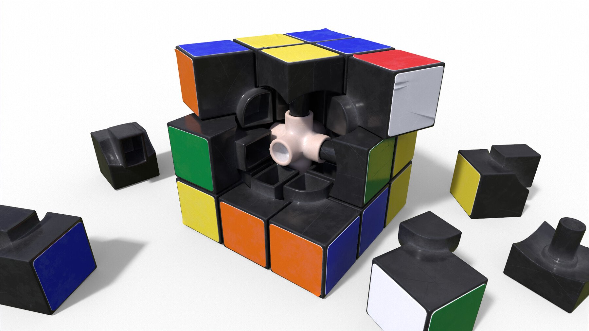

# Rubix

**A Rubik's Cube is 26 rotation matrices.**

Stickers, colors, faces, turns, even what "solved" means all follow from that one sentence. Rubix is a complete Rubik's Cube solver and visualizer. Its model and solver fit in [`rubix.py`](rubix.py), under 400 lines of plain Python and NumPy, with no sticker arrays, no permutation tables, and no pattern databases. It runs on vectors, matrices, and the occasional dot product.

<p align="center">
  
</p>

> [!NOTE]
> The core idea comes straight from Grant Sanderson's ([3Blue1Brown](https://www.3blue1brown.com)) [**Essence of Linear Algebra**](https://www.youtube.com/playlist?list=PLZHQObOWTQDPD3MizzM2xVFitgF8hE_ab), and its habit of asking *"where do the basis vectors land?"* Ask that about a Rubik's Cube and the puzzle falls apart in your hands, in a good way. Thank you, Grant.

---

## The whole model on one screen

This is the cube's state and all the rules of the game, taken from [`rubix.py`](rubix.py) with the memoization decorators and tuple conversions left out:

```python
# Each cubelet is named by its home in the solved cube, c ∈ {-1, 0, 1}³.
# The state of the cube is one rotation matrix per cubelet.
solved_cube = tuple((c, identity) for c in vectors if any(c))

# Where is a cubelet now? Rotate its home.
def position(cubelet, rotation): return rotation @ cubelet

# A move turns one slice: the cubelets on the far side of a plane rotate.
def apply_move_to_cubelet_rotation(move, cubelet, rotation):
  v, direction = move
  move_applies = np.dot(v, position(cubelet, rotation)) > 0
  return rotation_matrix(move) @ rotation if move_applies else rotation

# A cubelet is solved when each of its stickers points back where it started.
def is_cubelet_solved(cubelet, rotation):
  colors = np.diag(cubelet)
  color_positions = rotation @ colors
  return np.array_equal(colors, color_positions)
```

That looks too short to be a Rubik's Cube. The rest of this page explains why each line is needed and why nothing else is.

---

## 1. Stop counting stickers

The usual way to encode a cube is as 54 colored stickers in a flat array. Then the trouble starts. A single quarter turn moves 20 of those stickers across five faces, so every move needs its own hand-written permutation table, and each table entry is a place for a typo to hide. The geometry is gone, replaced by index arithmetic.

Rubix starts from what a Rubik's Cube physically is: 26 small plastic blocks called **cubelets**, riding on a rigid skeleton. A move does not shuffle stickers. It **rotates blocks**, and the stickers are glued on, so they rotate along with them.

So the full state of a cubelet is *which rotation has been applied to it*, and a rotation is a 3×3 matrix.

<details>
<summary><b>Vocabulary:</b> facelets, faces, cubelets, slices</summary>

<p align="center">
  
</p>

<p align="center">
  
</p>

</details>

---

## 2. Put the origin in the middle

Take a cube apart and look at what holds it together.

<p align="center">
  
</p>

At the heart of the cube is a **3D cross**: a core with six arms, each ending in a center piece. Every face turn spins one slice *around* one arm, and the cross itself never moves. (Turning the six outer faces is enough to reach every position, so Rubix never turns a middle slice or the whole cube. That restriction is what keeps the cross fixed.)

The cross is a ready-made coordinate system. Put the origin at the core and run the axes along the arms: **+x** is front, **+y** is right, **+z** is top. Every cubelet now has an integer address $c \in \lbrace -1, 0, 1 \rbrace^3$.

<p align="center">
  
</p>

The coordinates pay off right away. A nonzero coordinate means "this cubelet touches the outside along this axis," and touching the outside means carrying a sticker there. So counting nonzero coordinates counts stickers, and that count is the $L_1$ norm:

$$\|c\|_1 = |x| + |y| + |z| = \text{number of stickers}$$

| $\|c\|_1$ | Cubelet | Count | Example |
|:---:|:---|:---:|:---|
| 0 | core | 1 | $(0, 0, 0)$ |
| 1 | center | 6 | $(0, 0, 1)$ |
| 2 | edge | 12 | $(1, 0, 1)$ |
| 3 | corner | 8 | $(1, 1, 1)$ |

That turns cubelet classification into a single tuple lookup:

```python
cubelet_types = ("hidden", "center", "edge", "corner")
def describe_cubelet_type(cubelet): return cubelet_types[norm1(cubelet)]
```

The core has no stickers, and every rotation leaves the origin where it is. Nothing about it can change, so Rubix doesn't store it: that is the `if any(c)` in `solved_cube`, and it is why the cube has **26** rotation matrices instead of 27.

---

## 3. A color is a direction

What is "green"? In a solved cube, green is the face whose stickers all point toward $+x$. The centers never move, so that stays true for the whole solve. A color doesn't need its own enum, because it is already a unit vector:

```python
color_names = {
  (+1, 0, 0): "GREEN",   # front
  (0, +1, 0): "RED",     # right
  (0, 0, +1): "WHITE",   # top
  (-1, 0, 0): "BLUE",    # back
  (0, -1, 0): "ORANGE",  # left
  (0, 0, -1): "YELLOW",  # bottom
}
```

The six colors are the six standard basis vectors and their negatives. The names are only there for printing.

---

## 4. A cubelet's stickers are a matrix

Take the front-right-top corner, $c = (1, 1, 1)$. Its three stickers point along $(1,0,0)$, $(0,1,0)$, and $(0,0,1)$, which are exactly the components of $c$. Put them side by side as the columns of a matrix:

$$\mathrm{diag}(c) = \begin{pmatrix} x & 0 & 0 \\ 0 & y & 0 \\ 0 & 0 & z \end{pmatrix}$$

Every cubelet fits this one shape. A corner has three nonzero columns, one per sticker. An edge like $(1, 0, 1)$ has a **zero column** where its hidden side is, so the hidden side drops out with no special case. A center has a single nonzero column. As a bonus, $\mathrm{rank}(\mathrm{diag}(c)) = \|c\|_1$, so the sticker count from step 2 shows up again.

Each column means two things at once. By step 3, it is the sticker's **color**. It is also the direction the sticker **points**. In the solved cube the two coincide. Rotate the cubelet and they separate: the columns of $\mathrm{diag}(c)$ still give the colors, and the columns of $R \cdot \mathrm{diag}(c)$ give where those colors face now. One matrix product moves all of a cubelet's stickers at once.

<p align="center">
  
</p>

Reading a cubelet's colors is just a matter of pairing the two sets of columns ([`describe_config`](rubix.py#L75-L82)):

```python
colors = np.diag(cubelet)
color_positions = rotation @ colors
for color, pos in zip(colors.T, color_positions.T): ...
```

---

## 5. A move is a dot product and a matrix product

<p align="center">
  
</p>

A move is a unit vector $v$ (which face) and a direction (which way to turn). Which cubelets does it carry? The ones currently on the $v$ side of the cube, and one inner product finds them:

$$v \cdot (R\,c) > 0$$

No list of which cubelets belong to which face. Membership is geometry. The cubelets that pass the test get rotated, $R \leftarrow M_v R$, where $M_v$ is the 90° rotation about $v$ ([`apply_move_to_cubelet_rotation`](rubix.py#L123-L127)).

Some properties come for free:

- **Everything stays an integer.** Every $R$ is a product of 90° turns about coordinate axes, so it is a signed permutation matrix. Every entry stays in $\lbrace -1, 0, 1 \rbrace$, and there are only **24** such rotations: the symmetry group of the cube.
- **Corners stay corners.** Signed permutations preserve the $L_1$ norm, so $\|Rc\|_1 = \|c\|_1$ and no move can turn a corner into an edge. Nobody wrote that rule. It follows from what a rotation is.
- **Centers stay put.** A center lies on the axis of its own face's turn, and its dot product with every other face's vector is $0$ or $-1$, which fails the test. The cross from step 2 is fixed because of arithmetic, not because of bookkeeping.

---

## 6. Solved means every sticker is home

A cubelet is solved when each sticker points back toward the center of its own color:

$$R \cdot \mathrm{diag}(c) = \mathrm{diag}(c)$$

Now ask how much this equation actually constrains $R$:

| Cubelet | Nonzero columns | Rotations $R$ that count as solved |
|:---|:---:|:---|
| corner | 3 | only $I$, since three fixed columns pin $R$ down |
| edge | 2 | only $I$, since a rotation's third column is the cross product of the other two |
| center | 1 | **4 of 24**: any spin about its own axis |

The last row matters. A center with only one sticker can spin 90° in place and you can't see the difference. The equation can't see it either. Run the solver and it reports:

```
$ python rubix.py
...
is_cube_solved:  True
cube == solved_cube:  False
```

These two lines don't contradict each other. The cube is solved, and some centers ended up turned relative to where they started. A sticker array has no way to represent that difference, and a model that tracks the full state would need a special case to ignore it. `diag(c)` handles it with no extra code, because **the equation constrains exactly what the stickers can show**.

---

## The dictionary

| Rubik's Cube | Linear algebra |
|:---|:---|
| a cubelet | its home position $c \in \lbrace -1, 0, 1 \rbrace^3 \setminus \lbrace 0 \rbrace$ |
| corner, edge, or center | $\|c\|_1 = 3, 2, 1$ |
| a color | a unit vector $\pm e_i$ |
| a cubelet's stickers | the columns of $\mathrm{diag}(c)$ |
| the cube's state | one rotation matrix $R$ per cubelet |
| where a cubelet is | $R\,c$ |
| where its stickers face | $R \cdot \mathrm{diag}(c)$ |
| turning face $v$ | if $v \cdot Rc > 0$ then $R \leftarrow M_v R$ |
| solved | $R \cdot \mathrm{diag}(c) = \mathrm{diag}(c)$ |

---

## The solver

Rubix is not trying to find the shortest solution, and it doesn't claim to. It solves the cube **layer by layer, the way a person would**. Each step is an [A\*](https://en.wikipedia.org/wiki/A*_search_algorithm) search for "one more cubelet in place, without breaking the ones already placed":

1. **Top and middle layers.** 17 cubelets, one search each.
2. **Bottom cross.** Move the four bottom edges into place, then orient them.
3. **Bottom corners.** Move the four corners into their slots.
4. **Endgame.** Twist each corner with the classic `(L' U' L U) × 2` sequence. No search is needed here.

The encoding helps the search too. A\* needs an estimate of how far each cubelet is from home. In the rotation-matrix model, one cubelet in isolation has only **24 possible states**. So Rubix runs *the same `astar` function* over the rotation group of a single cubelet, memoizes the answer ([`min_moves_to_solved`](rubix.py#L214-L219)), and combines the results across the layer it is working on. The heuristic is computed on the fly from the model's own geometry, with no precomputed tables.

When a search stalls, it restarts with slightly randomized heuristic weights and a 1.5× larger move budget, keeping all progress from earlier layers. On a 100,000-move scramble, a solve usually takes **5–30 seconds** and **120–150 moves**, while simulating about 50,000 moves per second.

---

## Getting started

Requires Python 3.10+.

```bash
git clone https://github.com/smolkaj/rubix.git
cd rubix
python3 -m venv rubix_env && source rubix_env/bin/activate
pip install -r requirements.txt   # numpy, pygame, opencv-python, Pillow
```

### Interactive visualizer

```bash
python rubix_gui.py
```

- **Shuffle** applies a 999-move scramble.
- **Solve** runs the solver in the background and shows a live progress bar.
- **→ / ←** step forward and backward through the solution. Hold → to fast-forward.

### Command line

```bash
python rubix.py              # solve a 100,000-move scramble (seed 42)
python rubix.py 123          # ...with a different seed
python rubix.py --benchmark  # 100 seeds in a row
```

### As a library

```python
from rubix import solved_cube, shuffle, solve, describe_move, is_cube_solved, apply_move_to_cube

scrambled = shuffle(solved_cube, iterations=1000, seed=42)
solution = solve(scrambled)
for move in solution:
    print(describe_move(move))   # e.g. "clockwise rotation of top slice"

cube = scrambled
for move in solution:
    cube = apply_move_to_cube(move, cube)
assert is_cube_solved(cube)
```

### Tests

```bash
python3 -m unittest discover tests
```

The tests are built around algebraic identities. Four quarter turns are the identity, a move followed by its inverse cancels, the "sexy move" `R U R' U'` has order 6, and opposite faces commute. Alongside those are end-to-end solves and headless GUI rendering checks.

---

## Layout

| File | |
|:---|:---|
| [`rubix.py`](rubix.py) | The model and solver, under 400 lines |
| [`rubix_gui.py`](rubix_gui.py) | Pygame visualizer with animated playback |
| [`rubix_scanner.py`](rubix_scanner.py) | Experimental OpenCV scanner for physical cubes |
| [`scripts/`](scripts) | Generators for the diagrams on this page |
| [`tests/`](tests) | Unit and end-to-end tests |

---

## Invariants & Design Principles

- **A Functional Pearl (Maximally elegant, simple, and educational):** Rubix is designed in the tradition of a *functional pearl*—an elegant, instructive gem where the code is an executable mathematical specification. Code clarity, linear algebra transparency, and pedagogical beauty always trump micro-optimizations or clever programming tricks.
- **Self-documenting, transparent code:** Code should read as self-explanatory prose. Reject cryptic abbreviations, single-letter domain shorthand, or dense tuple indexing. Prefer clear, descriptive names (`left`, `top`, `bottom` rather than `L`, `U`, `D`) so anyone can understand the logic without an external decoder ring.
- **Zero ambient magic:** No obscure puzzle encodings or heavyweight dependencies. Pure NumPy vector and matrix arithmetic.
- **Strict code compactness:** The complete solver and domain model in `rubix.py` strictly stays below 400 lines of clean, readable Python.
- **Headless-friendly:** GUI components decouple display initializers so importing `rubix_gui` works seamlessly in headless CI/CD environments.
