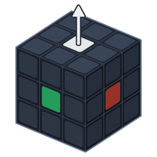
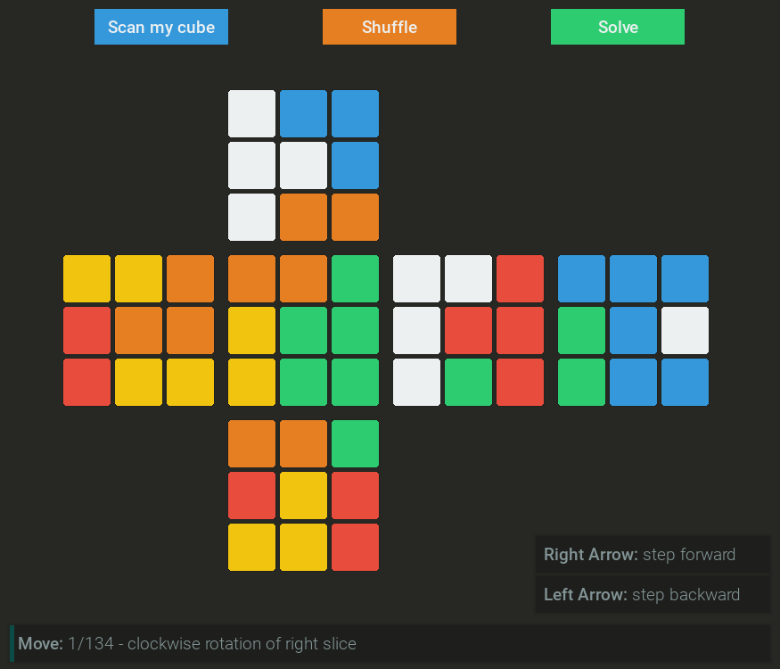
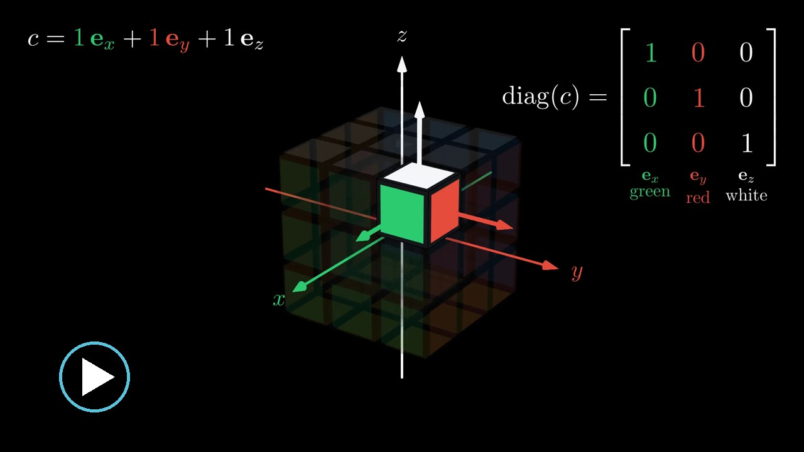

<p align="center">
  
</p>

<h1 align="center">Eigencube</h1>

> A **Functional Pearl**: A minimalistic Rubik's Cube solver in **under 400 lines of Python**, powered by **linear algebra**, accompanied by an interactive visualizer.

<p align="center">
  
</p>

Most Rubik's cube solvers rely on complex combinatorial bookkeeping: tracking 54 color stickers mapped across flat arrays, maintaining lookup tables for permutations, or precomputing massive 100MB pattern databases.

**Eigencube takes a different path.** By framing the puzzle in discrete 3-dimensional Euclidean space using linear algebra, the entire physics, state, and solution of the Rubik's Cube reduce to **vectors, rotation matrices, and dot products**.

The payoff of this linear algebra formulation is **radical simplicity**: the entire puzzle model, transformations, and multi-phase solver in [`eigencube.py`](eigencube.py) fit in **under 400 lines of readable Python**—with zero external puzzle libraries, zero lookup tables, and zero precomputed pattern databases.

> [!NOTE]
> **Shoutout:** The core insight for Eigencube was directly sparked by Grant Sanderson’s ([3Blue1Brown](https://www.3blue1brown.com)) masterclass YouTube series, [**Essence of Linear Algebra**](https://www.youtube.com/playlist?list=PLZHQObOWTQDPD3MizzM2xVFitgF8hE_ab). The series’ emphasis on geometric intuition—treating matrices as transformations of coordinate space and tracking where standard basis vectors land—inspired ditching messy combinatorial sticker permutations in favor of discrete 3D rotation matrices, vectors, and inner products. Massive praise and props to Grant for making linear algebra so intuitive, visual, and delightful!

---

## The Math Behind the Magic

<p align="center">
  <a href="https://github.com/smolkaj/eigencube/releases/download/explainer/eigencube-explainer.mp4">
    
  </a>
</p>

<p align="center">
  <b>▶ <a href="https://github.com/smolkaj/eigencube/releases/download/explainer/eigencube-explainer.mp4"><i>Eigencube, explained</i></a></b> (14 minutes, captioned)
</p>

The whole encoding, in motion and from first principles: a quick review of the linear algebra it uses, then the cube itself, built up one idea at a time. It is rendered with Manim straight from [`eigencube.py`](eigencube.py) (see [`explainer/`](explainer/)), in the spirit of Essence of Linear Algebra.

The model at a glance (the film's closing recap; keep the two in step):

| | |
|:--|:--|
| **Cubelets** | vectors $c \in \lbrace -1, 0, 1 \rbrace^3$: each cubelet's home address, from the fixed core |
| **Cubelet type** | $\lVert c \rVert_1 = \lvert x \rvert + \lvert y \rvert + \lvert z \rvert$ = number of stickers (core 0, center 1, edge 2, corner 3) |
| **Colors** | $\pm\mathbf{e}_x, \pm\mathbf{e}_y, \pm\mathbf{e}_z$: the never-moving centers, each an eigenvector of the turns around it |
| **Sticker colors** | the non-zero columns of $\mathrm{diag}(c)$ |
| **State** | one configuration $(c, R)$ per cubelet, with $R$ a rotation matrix |
| **Move** | the cubelets with $\mathbf{v} \cdot (R\,c) > 0$ turn ( $\mathbf{v}$: the face's axis): $R \leftarrow M R$ ( $M$: the quarter-turn matrix) |
| **Solved** | $R \cdot \mathrm{diag}(c) = \mathrm{diag}(c)$ for every cubelet |

---

## Solver Architecture

Finding the optimal solution to an arbitrary Rubik's cube is NP-hard, and God's Number (20 moves) requires massive precomputed pattern databases.

[`eigencube.py`](eigencube.py) implements a **hierarchical multi-phase A\* search** that mimics human layer-by-layer reduction, staying strictly under 400 lines without precomputed databases:

```
[Scrambled Cube]
       |
       v
Phase 1: Top Layer & Centers (17 cubelets)
       |
       v
Phase 2: Middle Layer Edges (4 cubelets)
       |
       v
Phase 3: Bottom Cross (4 edge orientations & positions)
       |
       v
Phase 4: Bottom Corners (4 corner placements & twists)
       |
       v
Phase 5: Endgame Permutation Alignment
       |
       v
 [Solved Cube]
```

### Guiding the Search: Distance Estimation
A\* needs a sense of direction so it doesn't search aimlessly. Rather than storing gigabytes of precomputed lookup tables, Eigencube calculates a quick distance estimate on the fly:
- **Individual cubelet distance (`min_moves_to_solved`):** Calculates how many 90° turns an isolated cubelet needs to reach its solved coordinate and orientation if no other cubelets were in the way.
- **Layer distance:** Combines the individual estimates of the active layer's target cubelets into a single distance score, pulling the search toward states where more cubelets are closer to home.
- **State caching:** Evaluates successor states with memoized transposition caching (`@functools.cache`).

### Search Performance & Randomized Restarts
- **Throughput:** Simulates ~50,000 moves/sec via vector dot products and memoized transposition caching.
- **Move-Budgeted Restarts:** To escape deep local plateaus in complex scrambles without storing massive precomputed pattern tables, A\* incorporates subtle priority randomization (`RANDOMIZE_SEARCH = True`) bounded by deterministic move budgets (`max_moves=100_000` with gentle $1.5\times$ expansion). Instead of wall-clock timers and OS signals, searches cut losses after exploring ~100k moves (~2s) and retry with fresh randomized weights without discarding prior layer progress. Typical scrambles solve in 5–25 seconds.

---

## Getting Started

### Prerequisites
- Python 3.10+
- Virtual environment (`venv`)

### Installation

```bash
# Clone the repository
git clone https://github.com/smolkaj/eigencube.git
cd eigencube

# Create and activate a virtual environment
python3 -m venv eigencube_env
source eigencube_env/bin/activate

# Install dependencies (numpy, pygame, opencv-python, Pillow)
pip install -r requirements.txt
```

---

## Usage

### 1. Interactive Pygame Visualizer

Launch the 2D cube net visualizer:

```bash
python eigencube_gui.py
```

- **Shuffle:** Click the **Shuffle** button to apply a 999-move scramble.
- **Solve:** Click the **Solve** button to run the A\* solver with a real-time progress bar.
- **Playback:**
  - `Right Arrow`: Step forward through the solution moves (hold to fast-forward at 15×).
  - `Left Arrow`: Step backward through the solution moves (rewind).

### 2. Command-Line Solver

Solve a scrambled cube directly from the terminal:

```bash
# Solve a 100,000-move scramble with default seed (42)
python eigencube.py

# Solve with a specific random seed
python eigencube.py 123

# Run benchmark across 100 random scrambles
python eigencube.py --benchmark
```

### 3. Programmatic Python API

Use `eigencube` as a lightweight puzzle simulation and solving library:

```python
from eigencube import solved_cube, shuffle, solve, describe_move, is_cube_solved, apply_move_to_cube

# Create a scrambled cube
scrambled = shuffle(solved_cube, iterations=1000, seed=42)
print("Is solved?", is_cube_solved(scrambled))  # False

# Compute solution moves
solution = solve(scrambled)
print(f"Solved in {len(solution)} moves:")
for move in solution:
    print(" -", describe_move(move))

# Apply solution and verify final state
final_cube = scrambled
for move in solution:
    final_cube = apply_move_to_cube(move, final_cube)
print("Is solved?", is_cube_solved(final_cube))  # True
```

---

## Testing

Run the test suite:

```bash
python3 -m unittest discover tests
```

The test suite covers:
- Representation invariants (cubelet counts, $L_1$ norms, canonical positions).
- Rotation matrix algebra (orthogonality $R^T R = I$, $\det(R) = 1$, axis preservation).
- Scramble reproducibility and seed determinism.
- End-to-end multi-phase solver execution on scrambled states.
- Headless GUI snapshot rendering verification.

---

## Codebase Structure

```
eigencube/
├── eigencube.py            # Core solver & linear algebra model (< 400 lines)
├── eigencube_gui.py        # Pygame GUI with animated moves & step playback
├── eigencube_scanner.py    # Computer vision scanner for physical cubes (OpenCV)
├── explainer/              # Animated video explainer of the encoding (Manim)
├── scripts/
│   ├── generate_cubelet_types.py # Cubelet types figure (blog.md)
│   └── generate_logo.py    # Logo, icons & GitHub social preview generator
├── tests/
│   └── test_eigencube.py   # Unit test suite
├── img/                # Logo, icons, screenshots & blog figures
│   ├── cube.png
│   ├── cubelet-types.png
│   ├── cube-in-plane.jpg
│   ├── gui-preview.png
│   ├── logo.svg            # Logo; generate_logo.py also writes the icons below
│   ├── apple-touch-icon.png
│   ├── favicon.ico
│   ├── icon.png            # GUI window icon
│   └── social-preview.png
├── requirements.txt    # numpy, pygame, opencv-python, Pillow
└── README.md
```

---

## Invariants & Design Principles

- **A Functional Pearl (Maximally elegant, simple, and educational):** Eigencube is designed in the tradition of a *functional pearl*—an elegant, instructive gem where the code is an executable mathematical specification. Code clarity, linear algebra transparency, and pedagogical beauty always trump micro-optimizations or clever programming tricks.
- **Self-documenting, transparent code:** Code should read as self-explanatory prose. Reject cryptic abbreviations, single-letter domain shorthand, or dense tuple indexing. Prefer clear, descriptive names (`left`, `top`, `bottom` rather than `L`, `U`, `D`) so anyone can understand the logic without an external decoder ring.
- **Zero ambient magic:** No obscure puzzle encodings or heavyweight dependencies. Pure NumPy vector and matrix arithmetic.
- **Strict code compactness:** The complete solver and domain model in `eigencube.py` strictly stays below 400 lines of clean, readable Python.
- **Headless-friendly:** GUI components decouple display initializers so importing `eigencube_gui` works seamlessly in headless CI/CD environments.
