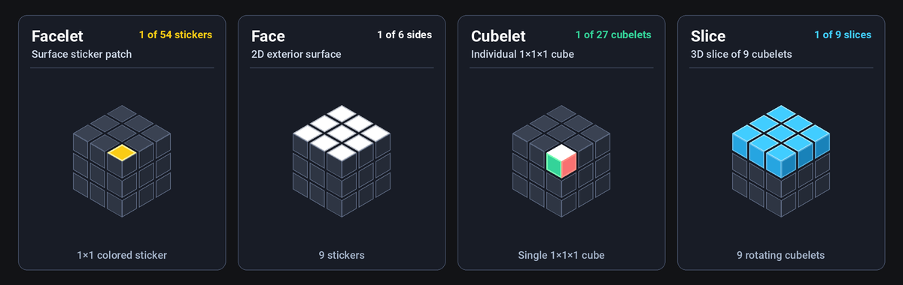
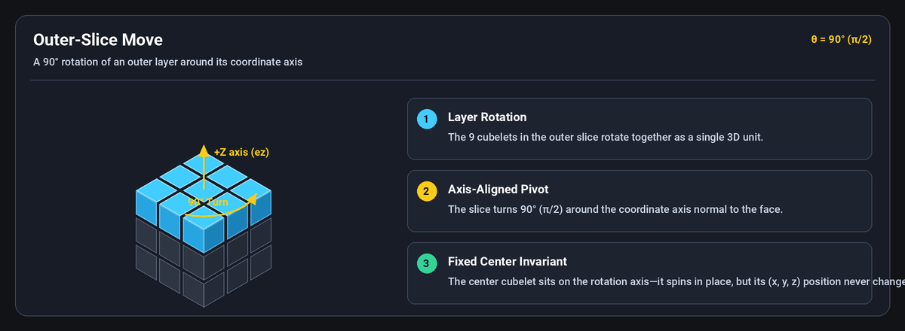
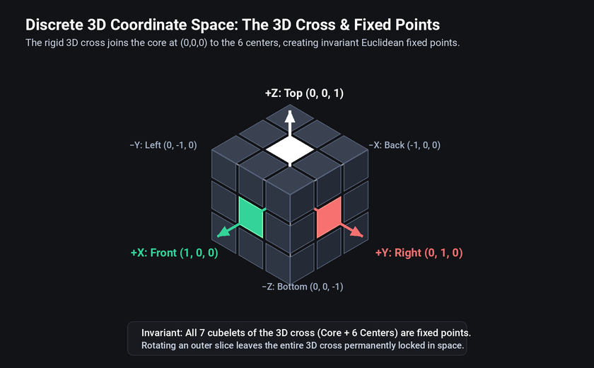
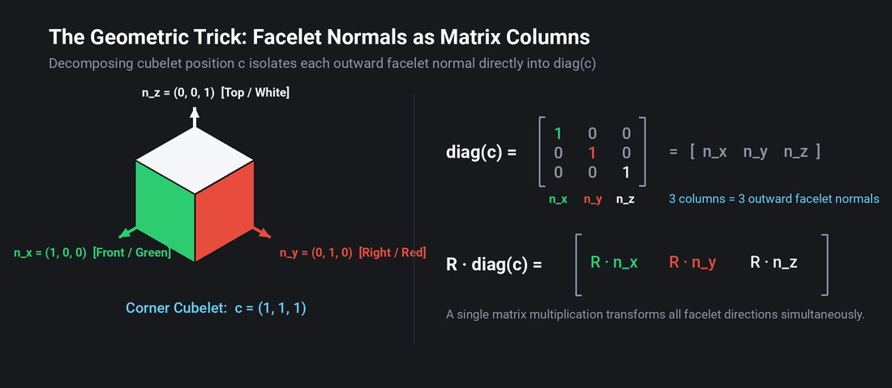

<p align="center">
  
</p>

<h1 align="center">Eigencube</h1>

> A **Functional Pearl**: A minimalistic Rubik's Cube solver in **under 400 lines of Python**, powered by **linear algebra**, accompanied by an interactive visualizer.

<p align="center">
  
</p>

Most Rubik's cube solvers rely on complex combinatorial bookkeeping: tracking 54 color stickers mapped across flat arrays, maintaining lookup tables for permutations, or precomputing massive 100MB pattern databases.

**Eigencube takes a different path.** By framing the puzzle in discrete 3-dimensional Euclidean space using linear algebra, the entire physics, state, and solution of the Rubik's Cube reduce to **vectors, rotation matrices, and dot products**.

The payoff of this linear algebra formulation is **radical simplicity**: the entire puzzle model, transformations, and multi-phase solver in [`eigencube.py`](eigencube.py) fit in **under 400 lines of readable Python**—with zero external puzzle libraries, zero lookup tables, and zero precomputed pattern databases.

> [!NOTE]
> **Shoutout:** The core insight for Eigencube was directly sparked by Grant Sanderson’s ([3Blue1Brown](https://www.3blue1brown.com)) masterclass YouTube series, [**Essence of Linear Algebra**](https://www.youtube.com/playlist?list=PLZHQObOWTQDPD3MizzM2xVFitgF8hE_ab). The series’ emphasis on geometric intuition—treating matrices as transformations of coordinate space and tracking where standard basis vectors land—inspired ditching messy combinatorial sticker permutations in favor of discrete 3D rotation matrices, vectors, and inner products. Massive praise and props to Grant for making linear algebra so intuitive, visual, and delightful!

---

## The Math Behind the Magic

### Key Terminology

<p align="center">
  
</p>

<p align="center">
  
</p>

<p align="center">
  
</p>

> [!TIP]
> **Key Idea 1 (Standard): Fix Centers by Restricting to Outer-Slice Moves**  
> The 12 90° outer-slice rotations (6 faces $\times$ 2 directions) are sufficient to generate any Rubik's Cube configuration. By omitting whole-cube and inner-slice rotations, the center cubelets remain permanently fixed in space.

---

### Step 1: Ditching the Sticker Permutation Nightmare

At first glance, representing a Rubik's cube might seem straightforward: track 54 colored stickers in a flat list. But this immediately runs into messy combinatorial bookkeeping:
- A single 90° face turn scrambles 12 edge and corner stickers across 4 adjacent faces.
- You must maintain lookup tables for how stickers permute, flip, and twist.
- The physics of 3D rigid bodies is lost in a tangle of array index math.

**What if we treat the Rubik's Cube as what it physically is: a rigid 3D object in space?**

Instead of 54 independent stickers, the puzzle is composed of **27 cubelets** arranged in a $3 \times 3 \times 3$ grid. 

Look inside a physical Rubik's cube, and its defining structural backbone becomes immediately apparent: a rigid **3-dimensional cross** connecting the internal core to the six face centers along the coordinate axes. When you turn an outer slice, it rotates *around* an arm of this cross.

By anchoring our origin at the core $(0, 0, 0)$, this 3D cross becomes our Cartesian coordinate frame:

<p align="center">
  
</p>

Each axis corresponds to an opposing pair of faces, with cubelet coordinates $(x, y, z) \in \lbrace -1, 0, 1 \rbrace^3$:
- **X-axis:** $+X$ points **Front** and $-X$ points **Back**.
- **Y-axis:** $+Y$ points **Right** and $-Y$ points **Left**.
- **Z-axis:** $+Z$ points **Top** and $-Z$ points **Bottom**.

> [!TIP]
> **Key Idea 2 (Eigencube): The 3D Cross as an Invariant Coordinate Frame**  
> All 7 cubelets forming the 3D cross (the internal core at $(0,0,0)$ and the 6 face centers at unit distance) are invariant fixed points in Euclidean space. Because every outer-slice move rotates strictly *around* an arm of this cross, the entire cross remains permanently stationary—anchoring our 3D reference frame throughout every legal move.
>
> In linear algebra terms: each arm of the cross is an **eigenvector** (with eigenvalue 1) of the rotation matrices that turn around it—hence the name *Eigencube*.

---

### Step 2: Testing the Coordinate System (Counting Facelets for Free)

We placed our coordinate origin at the center of the puzzle, assigning each of the 27 cubelets an integer vector $(x, y, z) \in \lbrace -1, 0, 1 \rbrace^3$.

Is this choice actually convenient, or did we just trade one set of headaches for another?

Recall that the four types of cubelets expose an arithmetic progression of colored facelets:
- **The Core (1 cubelet):** Exposes **0** facelets (hidden inside at the origin).
- **Centers (6 cubelets):** Expose **1** facelet (rotate in place, define face colors).
- **Edges (12 cubelets):** Expose **2** facelets.
- **Corners (8 cubelets):** Expose **3** facelets.

Notice the sequence of exposed facelets: **0, 1, 2, 3**.

<p align="center">
  
</p>

Now examine our coordinate values in $\lbrace -1, 0, 1 \rbrace$. Along each axis:
- A coordinate of $0$ means the cubelet is centered internally along that axis.
- A coordinate of $\pm 1$ means the cubelet touches the outer surface along that axis.

The absolute value $|x| \in \lbrace 0, 1 \rbrace$ acts as an on/off indicator for whether the cubelet touches an exterior boundary!

What happens if we add up the absolute values $|x| + |y| + |z|$ (the **Manhattan distance** or **$L_1$ norm** from the origin)?

$$\|c\|_1 = |x| + |y| + |z|$$

- At $(0, 0, 0)$: $|0| + |0| + |0| = \mathbf{0}$ $\rightarrow$ **Core** (0 facelets)
- At $(1, 0, 0)$: $|1| + |0| + |0| = \mathbf{1}$ $\rightarrow$ **Center** (1 facelet)
- At $(1, 1, 0)$: $|1| + |1| + |0| = \mathbf{2}$ $\rightarrow$ **Edge** (2 facelets)
- At $(1, 1, 1)$: $|1| + |1| + |1| = \mathbf{3}$ $\rightarrow$ **Corner** (3 facelets)

| Distance $\|c\|_1$ | Cubelet Type | Count | Exposed Facelets | Description |
|:---:|:---|:---:|:---:|:---|
| **0** | Core | 1 | 0 | Hidden internal mechanism; permanently at $(0,0,0)$ |
| **1** | Center | 6 | 1 | Fixed centers; rotate in place, define face colors |
| **2** | Edge | 12 | 2 | Border cubelets between two faces |
| **3** | Corner | 8 | 3 | Vertex cubelets joining three faces |

Total: $1 + 6 + 12 + 8 = 27$ cubelets.

> [!TIP]
> **Key Idea 3 (Eigencube): The Manhattan Norm Classifies Cubelets for Free**  
> Centering coordinates at $(0, 0, 0) \in \lbrace -1, 0, 1 \rbrace^3$ turns coordinate magnitudes into boundary indicators. The Manhattan distance $\|c\|_1 = |x| + |y| + |z|$ literally counts the number of visible colored facelets ($0 \to \text{Core}$, $1 \to \text{Center}$, $2 \to \text{Edge}$, $3 \to \text{Corner}$) with zero lookup tables or conditional branches.

---

### Step 3: Colors *Are* the Center Cubelets

Now comes the next puzzle: *how do we represent colors?*

In traditional software, colors are arbitrary strings (`'WHITE'`, `'GREEN'`) or integer tags (`0`, `1`). But look at the physical mechanism of a Rubik's Cube:

Because moves only rotate outer slices, the **6 center cubelets are the immovable arms of the 3D cross**. They never move relative to each other:
- The Green center is permanently at $(+1, 0, 0)$ [Front].
- The Blue center is permanently at $(-1, 0, 0)$ [Back].
- The Red center is permanently at $(0, +1, 0)$ [Right].
- The Orange center is permanently at $(0, -1, 0)$ [Left].
- The White center is permanently at $(0, 0, +1)$ [Top].
- The Yellow center is permanently at $(0, 0, -1)$ [Bottom].

Notice what just happened: **the 6 center cubelets are literally the standard Cartesian basis vectors $\mathbf{e}_x, \mathbf{e}_y, \mathbf{e}_z$ and their opposites!**

$$\mathbf{e}_x = \text{Green Center}, \quad \mathbf{e}_y = \text{Red Center}, \quad \mathbf{e}_z = \text{White Center}$$

Why invent separate color constants when the centers are already 3D vectors? We don't! **A color's identity is the constant position vector of its center cubelet**:

| Direction Vector | Color | Face | Defining Center Cubelet |
|:---|:---|:---|:---|
| $(+1, 0, 0)$ | Green | Front | Center at $(+1, 0, 0)$ |
| $(-1, 0, 0)$ | Blue | Back | Center at $(-1, 0, 0)$ |
| $(0, +1, 0)$ | Red | Right | Center at $(0, +1, 0)$ |
| $(0, -1, 0)$ | Orange | Left | Center at $(0, -1, 0)$ |
| $(0, 0, +1)$ | White | Top | Center at $(0, 0, +1)$ |
| $(0, 0, -1)$ | Yellow | Bottom | Center at $(0, 0, -1)$ |

With this identification, a facelet's intrinsic color is simply the center cubelet it points toward in the solved state (its outward normal vector at rest). When rotated by $R$, its color remains constant while its physical pointing direction becomes $R \cdot c_{\text{center}}$.

> [!TIP]
> **Key Idea 4 (Eigencube): Colors *Are* Basis Vectors**  
> Because the 6 center cubelets never move, they define the 3D coordinate axes. A color's identity is the constant unit position vector of its center cubelet ($c_{\text{center}}$), replacing arbitrary strings or integer enums with pure vector geometry.

---

### Step 4: The $\mathrm{diag}(c)$ Magic Trick (Packing Facelets into a Matrix)

Now consider any cubelet at its canonical home position $c = (x, y, z)^T$. We know what facelets it has, but how do we represent the orientation of all its facelets at the same time?

Let's decompose $c$ along the coordinate axes:

$$c = \begin{pmatrix} x \\ y \\ z \end{pmatrix} = x \begin{pmatrix} 1 \\ 0 \\ 0 \end{pmatrix} + y \begin{pmatrix} 0 \\ 1 \\ 0 \end{pmatrix} + z \begin{pmatrix} 0 \\ 0 \\ 1 \end{pmatrix} = \begin{pmatrix} x \\ 0 \\ 0 \end{pmatrix} + \begin{pmatrix} 0 \\ y \\ 0 \end{pmatrix} + \begin{pmatrix} 0 \\ 0 \\ z \end{pmatrix}$$

Look at the three component vectors:
- For the Front-Right-Top corner $c = (1, 1, 1)^T$, they are:
  - $(1, 0, 0)^T$ $\rightarrow$ Green (Front facelet normal)
  - $(0, 1, 0)^T$ $\rightarrow$ Red (Right facelet normal)
  - $(0, 0, 1)^T$ $\rightarrow$ White (Top facelet normal)
- Each non-zero component vector is an **outward unit normal** pointing directly toward one of the center cubelets!

What happens if we stack these three vectors side-by-side as the columns of a $3 \times 3$ matrix?

$$\mathrm{diag}(c) = \begin{pmatrix} x & 0 & 0 \\ 0 & y & 0 \\ 0 & 0 & z \end{pmatrix} = \begin{pmatrix} \mathbf{n}_x & \mathbf{n}_y & \mathbf{n}_z \end{pmatrix}$$

This diagonal matrix gives us an extraordinary unification:
- **Corners** (e.g. $c = (1, 1, 1)^T$): All 3 columns are non-zero unit vectors (Green, Red, White).
- **Edges** (e.g. $c = (1, 0, 1)^T$): Column 2 is $(0, 0, 0)^T$—the uncolored internal side ($y=0$) automatically drops out as a zero column!
- **Centers** (e.g. $c = (0, 0, 1)^T$): 2 columns are zero; only column 3 (White) is non-zero.
- **Interior** ($c = (0, 0, 0)^T$): All zero columns.

And notice the payoff connecting back to Step 2: **the matrix rank of $\mathrm{diag}(c)$ is exactly the Manhattan distance**:

$$\mathrm{rank}(\mathrm{diag}(c)) = \|c\|_1 = \text{number of visible facelets}$$

> [!TIP]
> **Key Idea 5 (Eigencube): Facelet Normals as Matrix Columns via $\mathrm{diag}(c)$**  
> Expanding coordinate vector $c$ into the diagonal matrix $\mathrm{diag}(c) = [\mathbf{n}_x \;\; \mathbf{n}_y \;\; \mathbf{n}_z]$ packs all outward facelet normal vectors directly into matrix columns. Hidden internal faces automatically vanish as zero columns, and matrix rank equals the Manhattan norm ($\mathrm{rank}(\mathrm{diag}(c)) = \|c\|_1$).

---

### Step 5: One-Shot Rotation & The Solved Invariant

Now, how do we track the state of the puzzle as moves are applied?

Every cubelet starts at its canonical home position $c \in \lbrace -1, 0, 1 \rbrace^3$ with an initial $3 \times 3$ identity rotation matrix $I_3$. When a sequence of 90° slice moves turns a cubelet, we accumulate those turns into a single $3 \times 3$ rotation matrix $R$.

1. **Where is the cubelet in 3D space right now?**
   $$p = R \cdot c$$
   In the solved cube, $p = I_3 \cdot c = c$.
2. **Where do all of its colored facelets point right now?**
   Because matrix multiplication distributes column-by-column:
   $$\text{Current facelet directions} = R \cdot \mathrm{diag}(c) = \begin{pmatrix} R \cdot \mathbf{n}_x & R \cdot \mathbf{n}_y & R \cdot \mathbf{n}_z \end{pmatrix}$$
   A single matrix multiply transforms **all facelets of the cubelet simultaneously**!
3. **When is a cubelet solved?**
   A cubelet is in its solved position and orientation if and only if all of its facelets point back toward their home center cubelets:
   $$R \cdot \mathrm{diag}(c) = \mathrm{diag}(c)$$

<p align="center">
  
</p>

In [`eigencube.py`](eigencube.py), checking whether a cubelet is solved ([`is_cubelet_solved`](eigencube.py#L204-L207)) or reading current facelet orientations ([`describe_config`](eigencube.py#L75-L82)) takes just two lines:

```python
colors = np.diag(cubelet)
color_positions = rotation @ colors
return np.array_equal(colors, color_positions)
```

No sticker permutation tables, no orientation state machines—just discrete 3D linear transformations.

> [!TIP]
> **Key Idea 6 (Eigencube): One-Shot Simultaneous Rotation via $R \cdot \mathrm{diag}(c)$**  
> Matrix multiplication distributes across columns simultaneously: $R \cdot \mathrm{diag}(c) = [R\mathbf{n}_x \;\; R\mathbf{n}_y \;\; R\mathbf{n}_z]$. A single matrix multiply rotates all facelets at once, reducing the solved test to $R \cdot \mathrm{diag}(c) = \mathrm{diag}(c)$ with zero permutation tracking.

---

### Step 6: Slice Moves as Hyperplane Dot Products

When a move rotates an outer slice (e.g., turning the Top face clockwise), which cubelets move?

In combinatorial code, you maintain a list of cubelet indices belonging to each face. In linear algebra, an outer slice is a coordinate half-space.

A move is specified by an axis unit vector $v \in \lbrace \pm e_x, \pm e_y, \pm e_z \rbrace$ and a direction $d \in \lbrace -1, +1 \rbrace$. Which cubelets lie in that slice? An inner product:

$$v \cdot p > 0 \iff v \cdot (R \cdot c) > 0$$

If this dot product is positive, the cubelet lies in the slice. To turn it, multiply its rotation matrix by the elementary 90° rotation matrix $M$:

$$R_{\text{new}} = M \cdot R$$

Because every turn is a 90° rotation along a coordinate axis, all matrix entries in $R$ remain integers in $\lbrace -1, 0, 1 \rbrace$.

> [!TIP]
> **Key Idea 7 (Eigencube): Slices as Coordinate Half-Spaces**  
> Instead of storing index sets for each face, determining which cubelets belong to an active slice is evaluated via a single inner product: $v \cdot (R \cdot c) > 0$.

---

## Solver Architecture

Finding the optimal solution to an arbitrary Rubik's cube is NP-hard, and God's Number (20 moves) requires massive precomputed pattern databases.

[`eigencube.py`](eigencube.py) implements a **hierarchical multi-phase A\* search** that mimics human layer-by-layer reduction, staying strictly under 400 lines without precomputed databases:

```
[Scrambled Cube]
       |
       v
Phase 1: Top Layer & Centers (17 cubelets)
       |
       v
Phase 2: Middle Layer Edges (4 cubelets)
       |
       v
Phase 3: Bottom Cross (4 edge orientations & positions)
       |
       v
Phase 4: Bottom Corners (4 corner placements & twists)
       |
       v
Phase 5: Endgame Permutation Alignment
       |
       v
 [Solved Cube]
```

### Guiding the Search: Distance Estimation
A\* needs a sense of direction so it doesn't search aimlessly. Rather than storing gigabytes of precomputed lookup tables, Eigencube calculates a quick distance estimate on the fly:
- **Individual cubelet distance (`min_moves_to_solved`):** Calculates how many 90° turns an isolated cubelet needs to reach its solved coordinate and orientation if no other cubelets were in the way.
- **Layer distance:** Combines the individual estimates of the active layer's target cubelets into a single distance score, pulling the search toward states where more cubelets are closer to home.
- **State caching:** Evaluates successor states with memoized transposition caching (`@functools.cache`).

### Search Performance & Randomized Restarts
- **Throughput:** Simulates ~50,000 moves/sec via vector dot products and memoized transposition caching.
- **Move-Budgeted Restarts:** To escape deep local plateaus in complex scrambles without storing massive precomputed pattern tables, A\* incorporates subtle priority randomization (`RANDOMIZE_SEARCH = True`) bounded by deterministic move budgets (`max_moves=100_000` with gentle $1.5\times$ expansion). Instead of wall-clock timers and OS signals, searches cut losses after exploring ~100k moves (~2s) and retry with fresh randomized weights without discarding prior layer progress. Typical scrambles solve in 5–25 seconds.

---

## Getting Started

### Prerequisites
- Python 3.10+
- Virtual environment (`venv`)

### Installation

```bash
# Clone the repository
git clone https://github.com/smolkaj/eigencube.git
cd eigencube

# Create and activate a virtual environment
python3 -m venv eigencube_env
source eigencube_env/bin/activate

# Install dependencies (numpy, pygame, opencv-python, Pillow)
pip install -r requirements.txt
```

---

## Usage

### 1. Interactive Pygame Visualizer

Launch the 2D cube net visualizer:

```bash
python eigencube_gui.py
```

- **Shuffle:** Click the **Shuffle** button to apply a 999-move scramble.
- **Solve:** Click the **Solve** button to run the A\* solver with a real-time progress bar.
- **Playback:**
  - `Right Arrow`: Step forward through the solution moves (hold to fast-forward at 15×).
  - `Left Arrow`: Step backward through the solution moves (rewind).

### 2. Command-Line Solver

Solve a scrambled cube directly from the terminal:

```bash
# Solve a 100,000-move scramble with default seed (42)
python eigencube.py

# Solve with a specific random seed
python eigencube.py 123

# Run benchmark across 100 random scrambles
python eigencube.py --benchmark
```

### 3. Programmatic Python API

Use `eigencube` as a lightweight puzzle simulation and solving library:

```python
from eigencube import solved_cube, shuffle, solve, describe_move, is_cube_solved, apply_move_to_cube

# Create a scrambled cube
scrambled = shuffle(solved_cube, iterations=1000, seed=42)
print("Is solved?", is_cube_solved(scrambled))  # False

# Compute solution moves
solution = solve(scrambled)
print(f"Solved in {len(solution)} moves:")
for move in solution:
    print(" -", describe_move(move))

# Apply solution and verify final state
final_cube = scrambled
for move in solution:
    final_cube = apply_move_to_cube(move, final_cube)
print("Is solved?", is_cube_solved(final_cube))  # True
```

---

## Testing

Run the test suite:

```bash
python3 -m unittest discover tests
```

The test suite covers:
- Representation invariants (cubelet counts, $L_1$ norms, canonical positions).
- Rotation matrix algebra (orthogonality $R^T R = I$, $\det(R) = 1$, axis preservation).
- Scramble reproducibility and seed determinism.
- End-to-end multi-phase solver execution on scrambled states.
- Headless GUI snapshot rendering verification.

---

## Codebase Structure

```
eigencube/
├── eigencube.py            # Core solver & linear algebra model (< 400 lines)
├── eigencube_gui.py        # Pygame GUI with animated moves & step playback
├── eigencube_scanner.py    # Computer vision scanner for physical cubes (OpenCV)
├── scripts/
│   ├── generate_anatomy.py # Cube anatomy diagram generator
│   ├── generate_diagram.py # Geometric intuition diagram generator
│   └── generate_logo.py    # Logo, icons & GitHub social preview generator
├── tests/
│   └── test_eigencube.py   # Unit test suite
├── img/                # Architectural diagrams & preview snapshots
│   ├── basis-colors-diag.png
│   ├── cube.png
│   ├── cubelet-types.png
│   ├── cube-anatomy.png
│   ├── cube-in-plane.jpg
│   ├── gui-preview.png
│   ├── logo.svg            # Logo; generate_logo.py also writes the icons below
│   ├── apple-touch-icon.png
│   ├── favicon.ico
│   ├── icon.png            # GUI window icon
│   └── social-preview.png
├── requirements.txt    # numpy, pygame, opencv-python, Pillow
└── README.md
```

---

## Invariants & Design Principles

- **A Functional Pearl (Maximally elegant, simple, and educational):** Eigencube is designed in the tradition of a *functional pearl*—an elegant, instructive gem where the code is an executable mathematical specification. Code clarity, linear algebra transparency, and pedagogical beauty always trump micro-optimizations or clever programming tricks.
- **Self-documenting, transparent code:** Code should read as self-explanatory prose. Reject cryptic abbreviations, single-letter domain shorthand, or dense tuple indexing. Prefer clear, descriptive names (`left`, `top`, `bottom` rather than `L`, `U`, `D`) so anyone can understand the logic without an external decoder ring.
- **Zero ambient magic:** No obscure puzzle encodings or heavyweight dependencies. Pure NumPy vector and matrix arithmetic.
- **Strict code compactness:** The complete solver and domain model in `eigencube.py` strictly stays below 400 lines of clean, readable Python.
- **Headless-friendly:** GUI components decouple display initializers so importing `eigencube_gui` works seamlessly in headless CI/CD environments.
