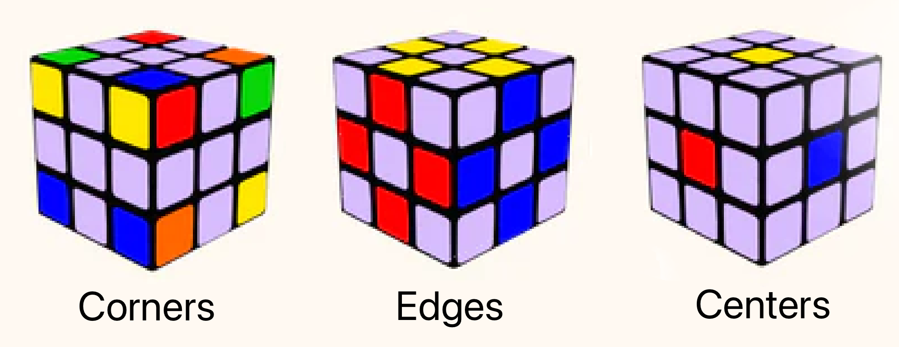
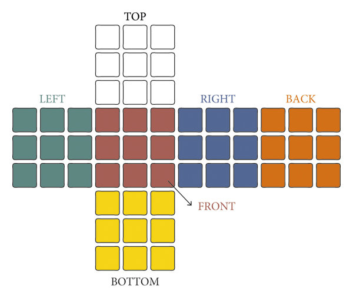
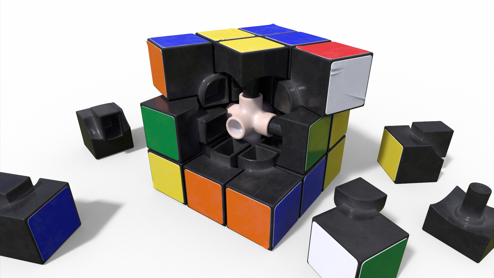

# Solving the Rubik's Cube in 300 Lines of Code

What does a Rubik's Cube have to do with Linear Algebra?
As it turns out, a lot!

In this article, I want to share an elgeant approach to implementing a Rubik's Cube solver, using Linear Algebra as the magic sauce that allows for beautiful and concise code.

## Basic Gemonetry of the Rubik's Cube

A Rubik's Cube is a 3-by-3-by-3 grid of 27 smaller cubes known as *cubelets*.


Each cubelet is itself a tiny cube and thus has 6 sides or *faces*, but only some of these faces are visible -- those at the exterior of the grid.
Counting the number of visible faces of a cubelet is useful for categorization:
* *corners*, or *corner cubelets*, have 3 visible faces,
* *edges*, or *edge cubelets*, have 2 visible faces,
* *centers*, or *center cubelets*, have 1 visible face, and
* the *hidden cublet* or *interior cubelet* has 0 visible faces[^1].



Zooming out, we can also look at the faces of the overall Rubik's Cube. Each Cube face is made up of a 3-by-3 grid of  cubelet faces.
Thus we have 6 * 3 * 3 = 54 visible cubelet faces overall.




## Colors and Objective of the Game
Each visible cubelet face is colored in one of 6 ways: 
white, green, red, blue, orange, or yellow.

The objective of the game is to arrange the cubelets such that
 each Cube face is made up of cubelet faces of the same color.

## Moves and Invariants

The Rubik's Cube can be manipulated by rotating any of its faces by 90° clockwise or counterclockwise. Other moves are possible, but are either subsumed by combining multiple of these *elementary moves*, or can be ignored because they are not useful for solving the Cube. For example:
* We can rotate faces by any multiple of 90° by rotating them by 90° multiple times in a row.
* We can rotate the entire Cube, but this is not helpful in solving the Cube.
* We can rotate faces by a fraction of 90°, but this is not helpful in solving the Cube.
* We can rotate a middle slice of the Cube sandwiched between two parallel Cube faces, but this is equivalent to rotating both faces in the opposite direction.

Elementary moves satisfy some important invariants that we are about to exploit:
* **Invariant 1:** Moves bijectively map corners to corners, edges to edges, centers to centers, and interiors to interios. In other words, they are type-preserving cubelet permutations.
* **Invariant 2:** Moves do not shift centers, except for maybe rotating them in place.
* **Invariant 3:** Moves neither shift nor rotate the interiror cubelet.
* **Invariant 4:** Moves bijectively map visible cubelet faces to visible cubelet faces and invisible cubelet faces to invisible cubelet faces. In other words, they are visibility-preserving cubelet face permutations.

## Modeling

Imaging anchoring a 3 dimensional coordinate system in the interior cube, which is fixed in space by Invariant 3

As we are about to see, all this can be modeled very succinctly using basic concepts from Linear Algebra.
the language of Linear Algebra allows us to catpure 


# Footnotes

[^1]: Technically, the interior cubelet is more of an "octopus joint", see the image below. But conceptually, we can think of it as just another cubelet --  especially since we can't see it!
  


## TODOs / Ideas
* Add pictures wherever that makes sense.
* Jupyter notebook
* part1 & 2: all the solving stuff is part 2

Point to linear algebra video.

Each cubelet has 9 

* faces
* colors
* movements
* 


## Code

```python
def l1_norm(vec): return sum(abs(x) for x in vec)

def describe_cubelet_type(cubelet):
  if l1_norm(cubelet) == 3: return "corner"
  if l1_norm(cubelet) == 2: return "edge"
  if l1_norm(cubelet) == 1: return "center"
  if l1_norm(cubelet) == 0: return "interior"
  assert False

assert(sum(describe_cubelet_type(c) == "corner" for c in cubelet) == 8)
assert(sum(describe_cubelet_type(c) == "edge" for c in cubelet) == 12)
assert(sum(describe_cubelet_type(c) == "center" for c in cubelet) == 6)
assert(sum(describe_cubelet_type(c) == "interior" for c in cubelet) == 1)
```
