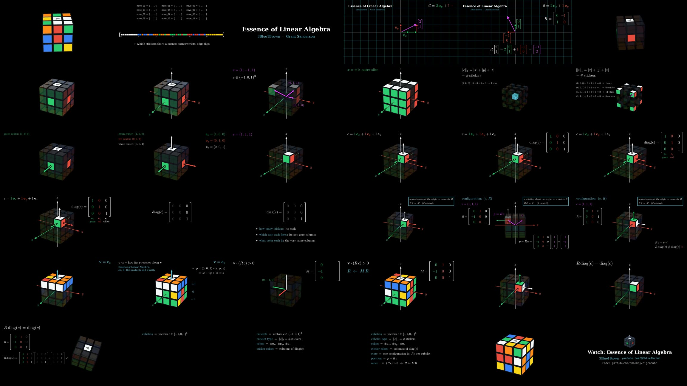

# Eigencube, explained

A 16-minute animated explainer of the Eigencube encoding, in the style of 3Blue1Brown's
[Essence of Linear Algebra](https://www.youtube.com/playlist?list=PLZHQObOWTQDPD3MizzM2xVFitgF8hE_ab)
(the series that sparked Eigencube in the first place).

The rendered film (1080p, ~35 MB, English captions embedded) is a build artifact rather than a checked-in file, since it would be several times the size of the rest of the repository; `python build.py` reproduces it.



| Chapter | What it shows |
|:--|:--|
| `StickerNightmare` | Why a 54-sticker list turns every move into index shuffling |
| `LinearAlgebraReview` | Vectors, the basis, rotation matrices from where the basis lands, eigenvectors |
| `FixedFrame` | The rigid cross never moves (each arm is an eigenvector of the turns around it), so it *is* the coordinate frame |
| `CountingStickers` | Coordinates of 0 mean inside, ±1 mean surface; the 1-norm of c counts stickers |
| `ColorsAreVectors` | The six colors are ±e<sub>x</sub>, ±e<sub>y</sub>, ±e<sub>z</sub> |
| `DiagTrick` | diag(c) packs a cubelet's sticker directions, which are its colors, into matrix columns |
| `Configuration` | A cubelet's configuration (c, R) is its entire state |
| `Moves` | A move is one dot product to select and one matrix product to turn |
| `Solved` | R diag(c) = diag(c), exactly as picky as the colors are |
| `Outro` | Recap, the solver at work, and a thank-you to Essence of Linear Algebra |

## How it is made

- [`scenes.py`](scenes.py) holds one [Manim](https://www.manim.community) scene per chapter, with each
  narration line written right next to the animation it accompanies.
- [`kit.py`](kit.py) draws the cube straight from [`eigencube.py`](../eigencube.py): every cubelet is
  drawn at its home address and transformed by its rotation matrix R, the cubelets a move turns are
  the ones Eigencube's own move turns, and code listings are its live source. Each build renders
  the model as it is at that moment.
- Narration is synthesized with [edge-tts](https://github.com/rany2/edge-tts) and cached by content.
  Each scene's timeline is paced by its spoken lines, and captions are timed by the words the voice
  actually speaks. `kit.PRONUNCIATION` holds the few spellings the voice needs to say what the
  captions show.
- [`check_speech.py`](check_speech.py) transcribes every line with a speech recognizer and lists the
  ones heard differently, to catch mispronunciations like "diagram" for "diag".

## Rebuilding

Requires Python 3.10+, [Manim's system dependencies](https://docs.manim.community/en/stable/installation.html)
(Cairo, Pango, FFmpeg, and a LaTeX distribution with `dvisvgm`), and network access for speech synthesis.

```sh
pip install -r requirements.txt
python build.py --draft   # fast 480p15 preview -> build/draft.mp4
python build.py           # final 1080p30 cut -> build/eigencube-explainer.mp4 (+ .srt)
# Either one renders only the chapters whose code changed since their last render.
pip install faster-whisper && python check_speech.py   # check pronunciation of the latest cut
python check_speech.py --sync   # check that captions match when their words are heard
# Publish the new cut: as the release asset, with its captions...
gh release upload explainer build/eigencube-explainer.mp4 build/eigencube-explainer.srt --clobber
# ...and in the README's player, which GitHub only takes as a file dropped into its web editor.
```
